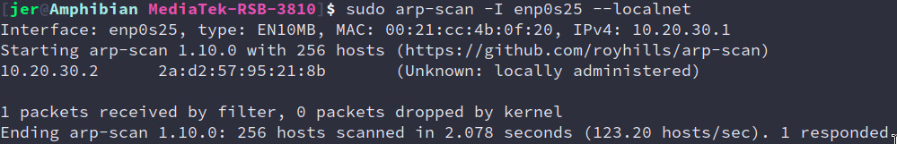

```sh
# assign our ethernet port 10.20.30.1
ip addr add 10.20.30.1/24 dev enp0s25 >/dev/null 2>&1
ip link set up dev enp0s25

# mask packets from the RSB-3810 as if they were coming from this machine
# otherwise, your home router won't know where to send packets
iptables -t nat -A POSTROUTING -j MASQUERADE

# allow our machine to send packets from other hosts, to other hosts(routing)
sysctl net.ipv4.ip_forward=1

# configure & run the dhcp server to provide an IP to the RSB-3810
(cat > /tmp/dhcpd.conf) << "EOF"
subnet 10.20.30.0 netmask 255.255.255.0 {
	range 10.20.30.2 10.20.30.40;
	option routers 10.20.30.1;
	option domain-name-servers 8.8.8.8;
}
EOF

dhcpd enp0s25 -cf /tmp/dhcpd.conf -d
```

```sh
rm -f /etc/resolv.conf &&
	echo nameservers 8.8.8.8 > /etc/resolv.conf
```





