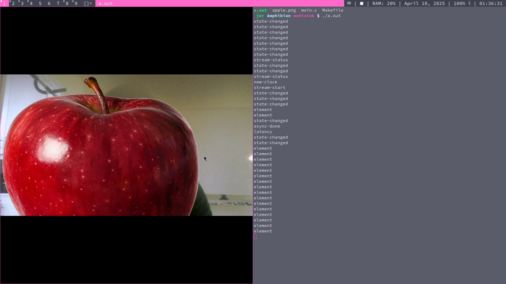

I got this tiny MediaTek RSB-3810 board which has some interesting
hardware accelerated video manipulation features.

I plugged in the power & ethernet & the ethernet light came on so I did
an arp-scan. My network was cluttered with a bunch of junk & I couldn't
figure out which one the board was, so I deicded I'd turn my laptop into a
"home router" & plugged the ethernet directly into my laptop.

These are the NICs my laptop has:


The board is plugged into enp0s25. This is the script I'm running for the
"home router" configuration(you'll want to install `isc-dhcp-server` & `iptables` for this):

```sh
# assign our ethernet port 10.20.30.1
ip addr add 10.20.30.1/24 dev enp0s25 >/dev/null 2>&1
ip link set up dev enp0s25

# mask packets from the RSB-3810 as if they were coming from this machine
# otherwise, your home router won't know where to send packets
iptables -t nat -A POSTROUTING -j MASQUERADE

# allow our machine to send packets from other hosts, to other hosts(routing)
sysctl net.ipv4.ip_forward=1

# configure & run the dhcp server to provide an IP to the RSB-3810
(cat > /tmp/dhcpd.conf) << "EOF"
subnet 10.20.30.0 netmask 255.255.255.0 {
	range 10.20.30.2 10.20.30.40;
	option routers 10.20.30.1;
	option domain-name-servers 8.8.8.8;
}
EOF

dhcpd enp0s25 -cf /tmp/dhcpd.conf -d
```


In this case, I saw that the board was asigned `10.20.30.2`.
I was able to log in over SSH - the username & password were both `ubuntu`.


I plugged the webcam in & ran `v4l2-ctl --list-devices`


I ran `ffplay udp://0.0.0.0:2000` on my laptop & ran the following on the board:

```
gst-launch-1.0 v4l2src device=/dev/video5 ! jpegdec ! x264enc ! udpsink host=10.20.30.1 port=2000
```


looks about right - let's add an image on top:

```
gst-launch-1.0 v4l2src device=/dev/video0 ! \
	jpegdec ! \
	gdkpixbufoverlay location=apple.png overlay-width=1000 overlay-height=1000 ! \
	x264enc ! \
	udpsink host=10.20.30.1 port=2000
```

When I ran that, nothing came out on the other end & gstreamer wrote:

```
WARNING: from element /GstPipeline:pipeline0/GstUDPSink:udpsink0: Attempting to send a UDP packets larger than maximum size (94235 > 65507)
Additional debug info:
../gst/udp/gstmultiudpsink.c(684): gst_multiudpsink_send_messages (): /GstPipeline:pipeline0/GstUDPSink:udpsink0:
Reason: Error sending message: Message too long
```

We have a couple options here:

- raise the client & host's NIC's MTU sizes, as well as the UDP RX/TX packet buffer sizes
- cut the bitrate in half

I chose the latter:

```
gst-launch-1.0 v4l2src device=/dev/video0 !
	jpegdec !
	gdkpixbufoverlay location=0.png overlay-width=1000 overlay-height=1000 !
	x264enc bitrate=1024 !
	udpsink host=10.20.30.1 port=2000
```


Let's take this pipeline down lower, and, for simplicity's sake, skip the
H.264 encoding & networking, and just get it running on my laptop first.

Here's how to do that in under 80 lines of C:

```c
#include <stdio.h>
#include <gst/gst.h>

int main(int argc, char *argv[]) {
	GstElement *pipeline, *src, *dec, *overlay, *sink;
	GError *err;
	gchar *info;
	GstBus *bus;
	GstMessage *m;

	gst_init(&argc, &argv);

	pipeline = gst_pipeline_new("pipeline");

	src      = gst_element_factory_make("v4l2src",          "src");
	dec      = gst_element_factory_make("jpegdec",          "dec");
	overlay  = gst_element_factory_make("gdkpixbufoverlay", "overlay");
	sink     = gst_element_factory_make("xvimagesink",      "sink");

	if (pipeline == NULL || src == NULL || dec == NULL || overlay == NULL || sink == NULL) {
		fprintf(stderr, "failed to initialize elemenets\n");
		return 1;
	}

	gst_bin_add_many(
		GST_BIN(pipeline),
		src,
		dec,
		overlay,
		sink,
		NULL
	);

	gst_element_link_many(
		src,
		dec,
		overlay,
		sink,
		NULL
	);

	g_object_set(G_OBJECT(src), "device", (argc > 1) ? argv[1] : "/dev/video0", NULL);

	g_object_set(G_OBJECT(overlay),
		"location",       "apple.png",
		"offset-x",       10,
		"offset-y",       10,
		"overlay-width",  1000,
		"overlay-height", 1000,
		NULL
	);

	gst_element_set_state(pipeline, GST_STATE_PLAYING);

	bus = gst_element_get_bus(pipeline);

	for (;;) {
		m = gst_bus_timed_pop(bus, GST_CLOCK_TIME_NONE);
		if (GST_MESSAGE_TYPE(m) == GST_MESSAGE_ERROR) {
			gst_message_parse_error(m, &err, &info);
			fprintf(stderr, "error: %s - %s - %s\n", GST_MESSAGE_TYPE_NAME(m), err->message, info);
			break;
		}
		fprintf(stderr, "%s\n", GST_MESSAGE_TYPE_NAME(m));
		gst_message_unref(m);
	}

	gst_element_set_state(pipeline, GST_STATE_NULL);
	gst_deinit();

	return 0;
}
```

Here's how to compile it:

```sh
cc main.c $(pkg-config --cflags --libs gstreamer-1.0)
```

If that doesn't work, make sure you have the following installed:

```
libgstreamer1.0-dev pkg-config gcc
```



I want to be able to move the apple around in real time.
We can do that with `g_object_set` like this:

```
g_object_set(G_OBJECT(overlay), "offset-x", 50, NULL);
```

However, we're blocked on `gst_bus_timed_pop`, waiting for warning &
error messages from gstreamer.

Ideally, I'd like to be able to write to standard in, like this:

```
offset-x 50
offset-y 100
```

There are a number of ways we can handle input from stdin & messages
from gst. For example, `pthreads(7)` or `select(2)`.

Though a different loop on a different thread may each for-loop more simple,
a `select` call should do just fine here.

If you're new to C, `select` is essentially `Promise.race` in Javascript,
where Promises are file-handles(we call them "file descriptors", "fd").

File-handles "resolve" when there's data to read, and the same file-handle
can resolve many times.

`gst_bus_get_pollfd` gives us a file-descriptor which we can select against.

We'll start by including the `select` header & some others for file-descriptor IO:

```c
#include <fcntl.h>
#include <unistd.h>
#include <sys/select.h>
```

Now our main-loop looks like this:

```c
	int n, gfd;
	fd_set fds;
	char buf[1024];

	gst_bus_get_pollfd(bus, (GPollFD*)&gfd);

	for (;;){
		FD_ZERO(&fds);
		FD_SET(0,   &fds);
		FD_SET(gfd, &fds);

		if (select(gfd+1, &fds, NULL, NULL, NULL) == -1) {
			if (errno == EINTR) {
				fprintf(stderr, "interrupted\n");
			} else {
				break;
			}
		}

		if (FD_ISSET(0, &fds)) {
			if ((n = read(0, &buf[0], sizeof(buf)-1)) <= 0) {
				break;
			}
			fprintf(stderr, "read: %.*s\n", n, &buf[0]);
		}

		if (FD_ISSET(gfd, &fds)) {
			m = gst_bus_pop(bus);
			if (GST_MESSAGE_TYPE(m) == GST_MESSAGE_ERROR) {
				gst_message_parse_error(m, &err, &info);
				fprintf(stderr, "error: %s - %s - %s\n", GST_MESSAGE_TYPE_NAME(m), err->message, info);
			} else {
				fprintf(stderr, "%s\n", GST_MESSAGE_TYPE_NAME(m));
			}
			gst_message_unref(m);
		}
	}
```

Note, we're echoing the gstreamer messages as well as stdin:

```c
if ((n = read(0, &buf[0], sizeof(buf)-1)) <= 0) {
	break;
}
fprintf(stderr, "read: %.*s\n", n, &buf[0]);
```


Now all we need to do is parse & set:

```c
if ((n = read(0, &buf[0], sizeof(buf)-1)) <= 0) {
	break;
}

buf[n] = '\0';

char key[32];
sscanf(buf, "%32s %d\n", &key[0], &n);
g_object_set(G_OBJECT(overlay), &key[0], n, NULL);
```


Mission accomplished.


